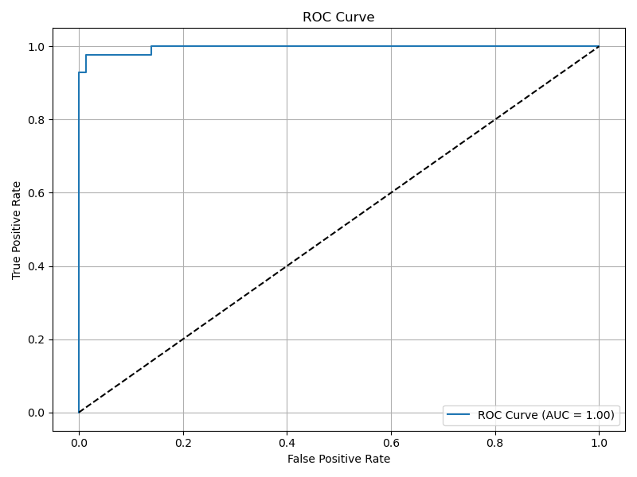

# 🧠 Breast Cancer Classifier with Logistic Regression

This project applies **Logistic Regression** on the **Breast Cancer Wisconsin dataset** (Kaggle) to classify tumors as **malignant** or **benign**, with visualizations, evaluation metrics, and a PDF report.



---

## 📦 Project Structure

```bash
logistic-regression-breast-cancer/
├── data/
│   └── data.csv
├── images/              # All saved plots
├── report/
│   └── final_report.pdf # Auto-generated PDF
├── main.py              # Core logistic regression code
├── generate_report.py   # PDF report builder
└── README.md
